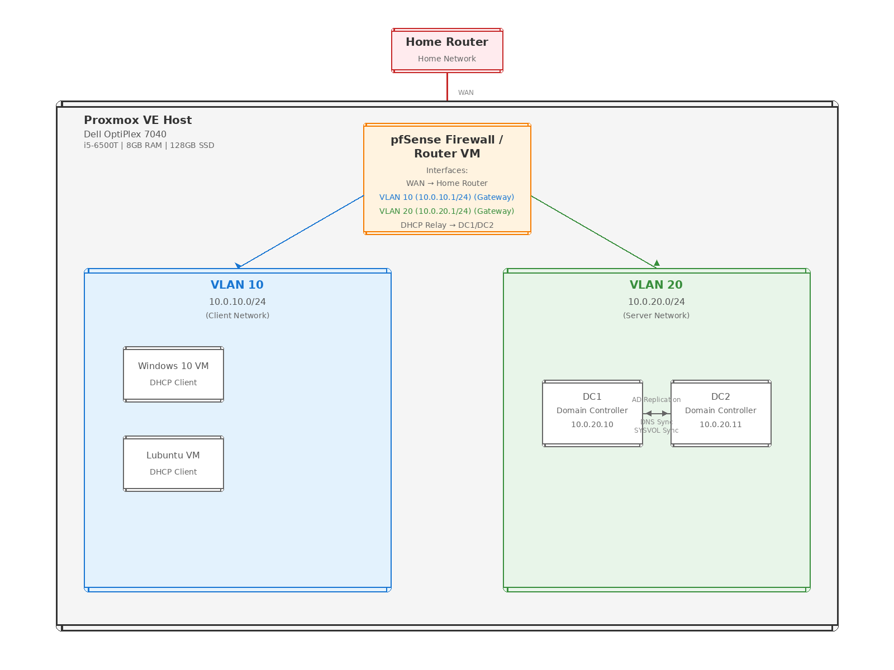

# virtualized-active-directory-infrastructure
Enterprise-style Active Directory infrastructure deployed on Proxmox VE with VLAN segmentation, redundancy, and failover validation.
## Architecture


### VLANs
- **VLAN 10 (Clients):** Windows 10 VM + Lubuntu VM  
- **VLAN 20 (Domain Controllers):** DC1 + DC2 (Windows Server 2022)

### Core Services
- **pfSense:** WAN/LAN, NAT, firewall isolation, DHCP relay
- **Active Directory:** AD DS + DNS + DHCP
- **Group Policy:** Shared folder + print services
- **Monitoring:** Host resource alert script (>90% threshold)

## Redundancy & Failover Test (Summary)
A secondary domain controller (DC2) was deployed and validated to support authentication and domain join operations during a primary controller outage.

**Key validation commands:**
```powershell
repadmin /replsummary
repadmin /showrepl
echo %logonserver%
nltest /dsgetdc:corp.local
